# ⚔️ KillBill

> **"Splitting bills shouldn't terminate friendships."**

**KillBill** is a modern, real-time expense splitting application reimagined with a bold, high-contrast aesthetic. It’s not just a calculator; it’s a statement. Whether you're settling a dinner tab or managing monthly rent with roommates, KillBill makes the transaction smooth, stylish, and instantaneous.

---

## 🎨 Design & Experience
We've ditched the boring spreadsheets for a cinematic experience.
- **Dynamic Theming**: Switch between the high-octane **Kill Bill Mode** (Yellow/Black) and the professional **Wise Mode** (Clean/Minimal).
- **Real-Time Everything**: See expenses appear as your friends type them.
- **Fluid Animations**:  Powered by Framer Motion for that premium feel.

---

## 🏗 Architecture

KillBill uses a "Client-First" architecture powered by **InstantDB** to ensure your data is always in sync without complex backend logic.

```mermaid
graph TD
    User([👤 User]) -->|Interacts| UI[🖥️ React UI]
    UI -->|Updates State| Optimistic[⚡ Optimistic UI]
    Optimistic -->|Syncs| IDB[🔥 InstantDB]
    IDB -->|Real-time Push| Peers([👥 Other Friends])
    
    subgraph "The KillBill Experience"
    UI
    Optimistic
    end
```



### 🛣️ User Journey


---

## 🚀 ELi5 Elevator Pitch
**"It's like WhatsApp for your money, but cooler."**
Imagine you and your friends go on a trip. You pay for gas, Dave pays for dinner, and Sarah buys the tickets. At the end, nobody knows who owes what. KillBill is a magic notebook that everyone shares. You just write down what you paid, and it instantly tells everyone exactly who needs to pay whom to make it even. No math, no arguments, just solved.

---

## 👵 Explain to Mom
"Mom, you know how when we go out to a big family dinner, you put the bill on your card, but then Uncle Bob pays for the tip, and Aunt Susan buys dessert separately? And then later we all try to figure out who owes you money?"

**KillBill is an app that does that math for us automatically.**
As soon as you pay the waiter, I tap "Mom paid $200" on my phone, and it instantly pops up on Uncle Bob's phone saying "You owe Mom $50". It creates a shared list so we never have to awkwardly ask "Hey, did you pay me back for that coffee?" again.

---

## 🛠️ Tech Stack

Built with the latest web technologies for speed and developer joy.

| Category | Technology | Usage |
|----------|------------|-------|
| **Core** |  | The view library |
| **Build** |  | Blazing fast build tool |
| **Styling** |  | Utility-first CSS |
| **Motion** |  | Production-ready animations |
| **Database** |  | Real-time graph database |

---

## 📦 Installation

```bash
# Clone the repo
git clone https://github.com/send2cloud/anti-killbill.git

# Enter the dojo
cd anti-killbill

# Install dependencies
npm install

# Start the dev server
npm run dev
```

---

_Project maintained by the Antigravity Team._
